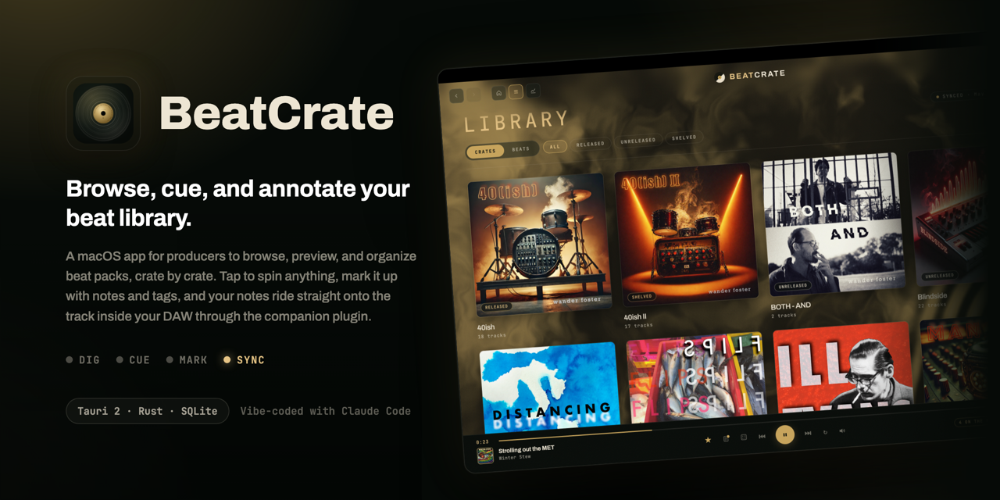
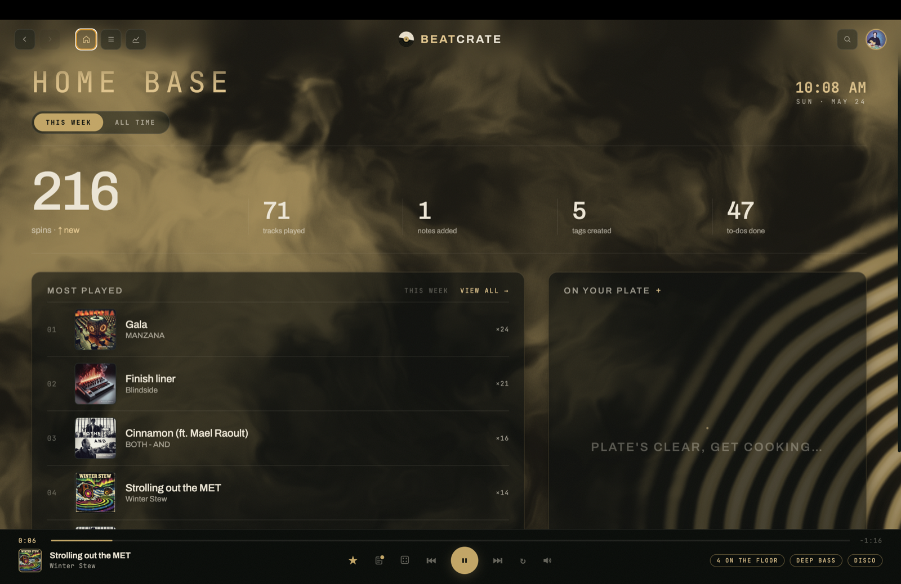
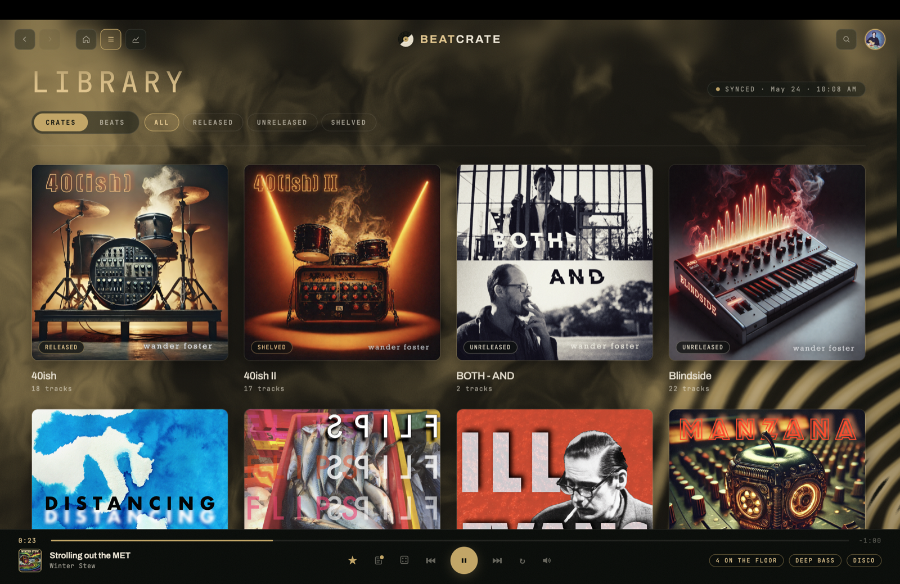
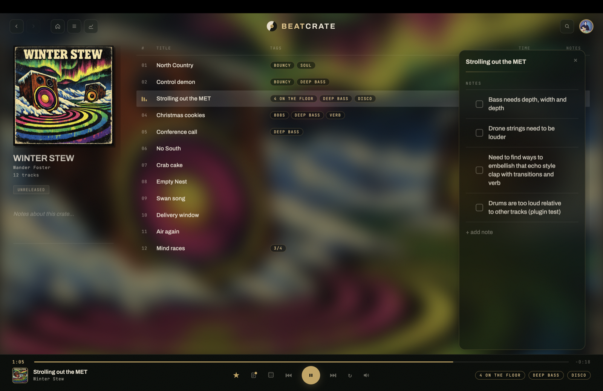
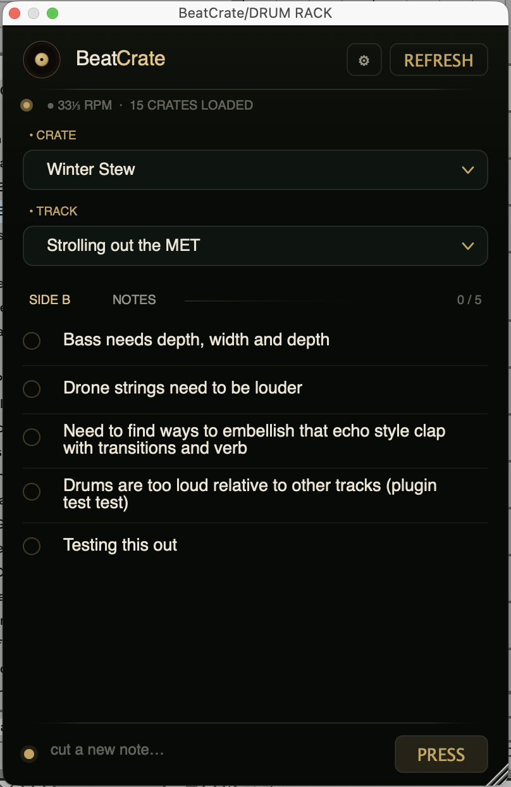
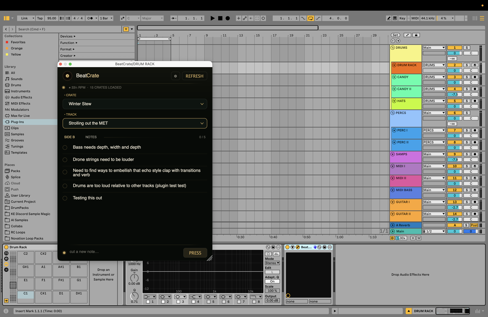
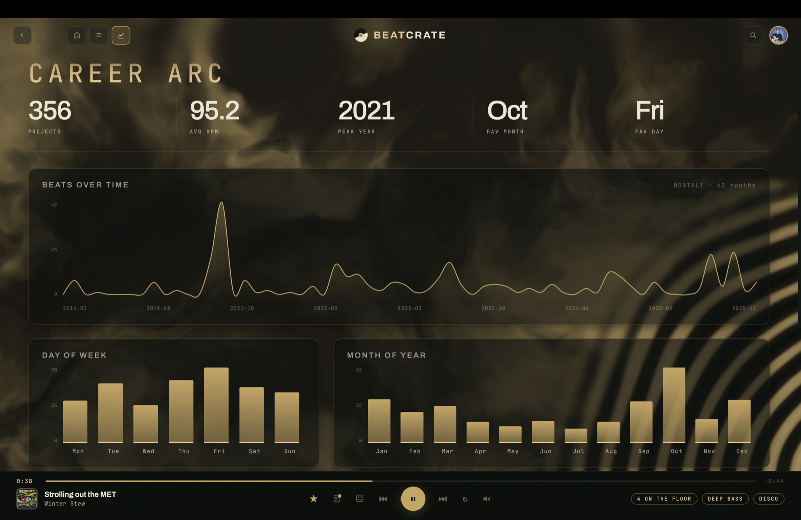

<p align="center">
  
</p>

<p align="center">
  
  
  
  
  
  
</p>

---

## What it is

My beat library had become a graveyard. In productive stretches I keep a beat-a-day
cadence and things pile up fast — sketches, half-finished ideas, tracks too good to
delete. Listening back was uninspired: open Finder, dig through subfolders, wait for
Quick Look, listen to 30 seconds, try another. Good beats sank to the bottom of a
folder tree and never came back up.

BeatCrate is the daily driver I built to fix that, a personal, single-user macOS app that ships **unsigned**, runs
**entirely local**, no accounts, no cloud, no telemetry. Point it at where you keep your tracks and the whole library comes back as something you actually want to dig through.

- **A catalogue, not a folder tree** — the interface is organized around **crates**, each with its own cover and identity. You see the whole library
  at a glance, and the Home base keeps recent activity — most-played, notes, todos —
  top of mind.

  <table>
    <tr>
      <td width="50%"></td>
      <td width="50%"></td>
    </tr>
  </table>

  *Home base (left) — stats and recent activity at a glance. Library (right) — every crate, one surface.*

- **Instant, level-matched preview** — tap any track to audition it. Playback is
  buffer-cached for gapless resume, and it's a first-class macOS media citizen, so
  **F7/F8/F9, the Now Playing widget, and media keys** all drive it like a real player.
  Every track gets an integrated-loudness (LUFS) measurement so preview levels are
  matched and nothing jumps out louder than the rest — pure-Rust (`symphonia` +
  `ebur128`), no ffmpeg.

- **Notes that travel into your DAW** — every track has a **notes panel**: write down
  what you're hearing, what's missing, what to bring back next session. Tag tracks, star
  favorites, keep a todo list. And the notes *travel* — a companion **VST3 + AU plugin**
  loads in just about any Mac DAW (Logic, Ableton, Reaper, Bitwig, GarageBand) and reads
  the exact same database the app writes. Pick the crate and track in the plugin and your
  notes are right there on the channel: tick them off, add new ones, edit inline. Both
  stay in sync, and BeatCrate doesn't even have to be running.

  <table>
    <tr>
      <td width="50%"></td>
      <td width="50%"></td>
    </tr>
  </table>

  *The notes panel in BeatCrate (left), and the companion plugin (right) showing the **same** notes — "Strolling out the MET" — loaded inside the DAW.*

  

  *The plugin in context — a small panel on the channel, driven by the shared database. (Shown in Ableton Live; it loads in any VST3 or AU host.)*

- **Career arc** *(Ableton)* — when BeatCrate ingests your root folder it also reads your
  Ableton `.als` projects (gunzip + a read-only XML walk) and charts the ebbs and flows of
  your output over time: bursts, gaps, quiet months, prolific ones, peak year/month/day.
  This one view is Ableton-specific for now; the library, preview, and notes plugin work
  the same in any DAW.

  

  *Career arc — projects over time, and the shape of your creative output.*

- **Live folder watcher** — drop a new pack in and it shows up; rename a folder and it
  reconciles in place without losing your notes or tags. The library stays current
  without a manual re-scan.

- **Local-first** — everything lives in one SQLite database at
  `~/Library/Application Support/BeatCrate/beatcrate.db` (the same file the plugin reads).
  No server, no network listener, no accounts, no telemetry, no cloud sync.

### What's next

BeatCrate v1 is the daily driver I built for myself. A few things on my mind:

- **Mobile companion** — for the all-important *car test* of new tracks: cue up a crate,
  listen on the road, leave notes that sync back to the desktop.

## Download

Grab the latest **[BeatCrate.dmg](https://github.com/andrewmfoster/BeatCrate/releases/latest/download/BeatCrate.dmg)**
from [Releases](https://github.com/andrewmfoster/BeatCrate/releases/latest), open it,
and drag **BeatCrate** to Applications. The companion plugin ships in the same release as
`BeatCrate-plugin-VST3-AU.zip` — see [plugin/](plugin/) for install.

The app is **unsigned** (personal use, local-only), so macOS will refuse to open it on
first launch. To open it anyway: right-click **BeatCrate.app → Open** → confirm; or
**System Settings → Privacy & Security → Open Anyway**. macOS remembers after the first
launch.

## Stack

- **UI:** vanilla HTML / CSS / JS (no framework), Web Audio for playback, a WebGL mesh
  shader for the backdrop. The renderer talks to Rust over Tauri `invoke()` — no web
  server, no localhost, no HTTP.
- **Core:** Rust + Tauri 2, `rusqlite` (bundled SQLite, no system dependency). Audio
  duration via `lofty`, loudness via `symphonia` + `ebur128`, `.als` parsing via `flate2`
  + `roxmltree`, live watching via `notify` — all pure-Rust, no sidecars.
- **Companion plugin:** JUCE / C++, builds VST3 + AU — see **[plugin/](plugin/)**.
- **Packaging:** Tauri (`cargo tauri build`, Apple Silicon / arm64, ~7 MB).

## Build from source

```bash
# Requires: macOS (Apple Silicon), a Rust toolchain (https://rustup.rs),
# and the Tauri CLI (cargo install tauri-cli)
git clone https://github.com/andrewmfoster/BeatCrate.git
cd BeatCrate/src-tauri

cargo tauri dev      # dev app — compiles Rust, opens the window, hot-serves public/
cargo tauri build    # release .dmg → target/release/bundle/dmg/
```

The first Rust build is slow (it compiles a bundled SQLite + `symphonia` from source);
incremental rebuilds are fast.

```
BeatCrate/
├── src-tauri/
│   ├── src/lib.rs          — Tauri builder, app state, startup ingest, live watcher
│   ├── src/commands.rs     — ~60 #[tauri::command]s (the renderer's whole API)
│   ├── src/db.rs           — SQLite schema + idempotent migrations
│   ├── src/ingestion.rs    — scans the music folder into crates + tracks
│   ├── src/als.rs          — Ableton .als project indexer
│   └── src/loudness.rs     — integrated-loudness (LUFS) analysis, pure-Rust
├── public/                 — single-page frontend (app.js · style.css · index.html)
├── plugin/                 — companion VST3 + AU plugin (JUCE / C++)
└── icon/ · screenshots/    — banner + README captures
```

## Security & privacy

BeatCrate runs entirely on-device. There's no server and no network listener of any
kind. Everything lives in one local SQLite database at
`~/Library/Application Support/BeatCrate/beatcrate.db` — the same file the companion
plugin reads. No accounts, no telemetry, no cloud sync.

I'm a producer and hobbyist builder. Feedback and PRs welcome — if you spot something I
missed, open an issue. See [SECURITY.md](SECURITY.md) to report a vulnerability privately.

## License

MIT — see [LICENSE](LICENSE).
